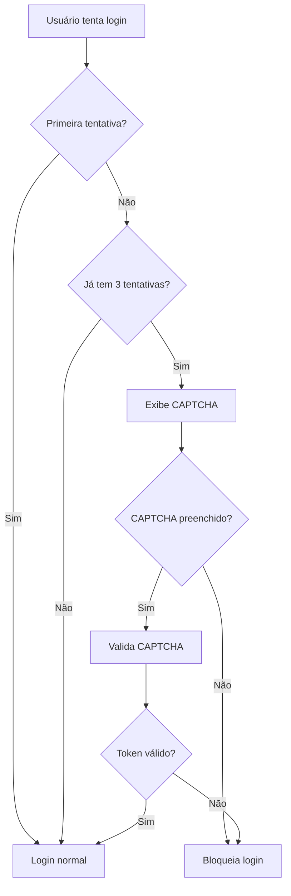

# Configuração do Google reCAPTCHA

## Visão Geral

Este guia explica como configurar o Google reCAPTCHA v2 para o sistema de autenticação.

---

## Por que reCAPTCHA?

O reCAPTCHA é exigido após **3 tentativas falhadas de login** para:
- 🛡️ Prevenir ataques de força bruta
- 🤖 Bloquear bots automatizados
- 🔒 Adicionar camada extra de segurança

---

## Configuração

### 1. Obter Chaves do Google

1. Acesse: https://www.google.com/recaptcha/admin
2. Clique em **"+ Criar"** ou **"Add Site"**
3. Preencha o formulário:

   ```
   Label: Dashboard TI BR Marinas (ou nome de sua preferência)
   
   reCAPTCHA type: ✅ reCAPTCHA v2
                   ✅ "I'm not a robot" Checkbox
   
   Domains:
   - localhost (para desenvolvimento)
   - seu-dominio.com.br (para produção)
   ```

4. Aceite os termos e clique em **"Submit"**
5. **Copie** as chaves geradas:
   - **Site Key** (chave pública)
   - **Secret Key** (chave privada - não usada no frontend)

### 2. Configurar no Projeto

Adicione a **Site Key** no arquivo `.env`:

```bash
# .env
VITE_RECAPTCHA_SITE_KEY=6LcXXXXXXXXXXXXXXXXXXXXXXXXXXXXXXXXX
```

### 3. Chave de Teste (Desenvolvimento)

Para testes em **localhost**, você pode usar a chave de teste do Google:

```bash
# Chave de teste - funciona APENAS em localhost
VITE_RECAPTCHA_SITE_KEY=6LeIxAcTAAAAAJcZVRqyHh71UMIEGNQ_MXjiZKhI
```

⚠️ **IMPORTANTE:** Esta chave **NÃO funciona em produção**. Configure sua própria chave.

---

## Como Funciona

### Fluxo de Autenticação



### Código (Simplificado)

```typescript
// Verificar se precisa CAPTCHA
const { requiresCaptcha } = useAuth();
const showCaptcha = requiresCaptcha(email); // true após 3 tentativas

// Componente
{showCaptcha && (
  <ReCAPTCHA
    sitekey={RECAPTCHA_SITE_KEY}
    onChange={(token) => setCaptchaToken(token)}
  />
)}

// Login
await signIn(email, password, captchaToken);
```

---

## Verificação no Backend (Recomendado)

Para produção, é **altamente recomendado** validar o token CAPTCHA no backend:

### 1. Criar Endpoint de Validação

```typescript
// backend/api/verify-captcha.ts
import fetch from 'node-fetch';

export async function verifyCaptcha(token: string, ip: string) {
  const secretKey = process.env.RECAPTCHA_SECRET_KEY;
  
  const response = await fetch(
    'https://www.google.com/recaptcha/api/siteverify',
    {
      method: 'POST',
      headers: { 'Content-Type': 'application/x-www-form-urlencoded' },
      body: `secret=${secretKey}&response=${token}&remoteip=${ip}`
    }
  );
  
  const data = await response.json();
  return data.success === true;
}
```

### 2. Integrar no Login

```typescript
// backend/auth/login.ts
import { verifyCaptcha } from './verify-captcha';

export async function handleLogin(email, password, captchaToken, ip) {
  // Verificar CAPTCHA primeiro
  if (requiresCaptcha(email)) {
    const isValid = await verifyCaptcha(captchaToken, ip);
    if (!isValid) {
      throw new Error('CAPTCHA inválido');
    }
  }
  
  // Continuar com autenticação
  // ...
}
```

---

## Personalização

### Tema

```tsx
<ReCAPTCHA
  sitekey={RECAPTCHA_SITE_KEY}
  onChange={handleCaptchaChange}
  theme="dark" // ou "light"
/>
```

### Tamanho

```tsx
<ReCAPTCHA
  sitekey={RECAPTCHA_SITE_KEY}
  onChange={handleCaptchaChange}
  size="compact" // ou "normal"
/>
```

### Idioma

```tsx
<ReCAPTCHA
  sitekey={RECAPTCHA_SITE_KEY}
  onChange={handleCaptchaChange}
  hl="pt-BR" // português brasileiro
/>
```

---

## Troubleshooting

### Erro: "Invalid site key"

**Causa:** Chave inválida ou não configurada

**Solução:**
1. Verificar se `VITE_RECAPTCHA_SITE_KEY` está no `.env`
2. Verificar se a chave está correta (sem espaços)
3. Reiniciar o servidor de desenvolvimento após alterar `.env`

### Erro: "ERROR for site owner: Invalid domain"

**Causa:** Domínio não autorizado

**Solução:**
1. Acessar https://www.google.com/recaptcha/admin
2. Editar configuração do site
3. Adicionar o domínio atual em "Domains"
4. Aguardar alguns minutos para propagação

### CAPTCHA não aparece

**Causa:** reCAPTCHA não está sendo exigido

**Solução:**
1. Fazer 3 tentativas de login com senha errada
2. Verificar console do navegador por erros
3. Verificar se `requiresCaptcha(email)` retorna `true`

### CAPTCHA sempre aparece

**Causa:** Tentativas não estão sendo resetadas

**Solução:**
1. Fazer login com credenciais corretas
2. Limpar localStorage/cookies
3. Verificar se `resetLoginAttempts` está sendo chamado

---

## Limites e Quotas

### Gratuito

- ✅ Ilimitadas requisições
- ✅ Sem custo
- ✅ Para uso pessoal e comercial

### Enterprise (Pago)

- Análise avançada de risco
- Suporte prioritário
- SLA garantido
- Customização completa

Mais info: https://cloud.google.com/recaptcha-enterprise

---

## Segurança

### ✅ Boas Práticas

- **Sempre** validar o token no backend
- **Nunca** expor a Secret Key no frontend
- **Renovar** token após cada tentativa
- **Limitar** tentativas mesmo com CAPTCHA

### ❌ Não Fazer

- Confiar apenas na validação do frontend
- Reutilizar tokens CAPTCHA
- Armazenar Secret Key no código
- Desabilitar CAPTCHA em produção

---

## Alternativas

Se preferir não usar Google reCAPTCHA:

### hCaptcha
- Mais focado em privacidade
- API similar ao reCAPTCHA
- https://www.hcaptcha.com/

### Cloudflare Turnstile
- Sem puzzles visuais
- Totalmente invisível
- https://www.cloudflare.com/products/turnstile/

### Implementação Personalizada
- CAPTCHA matemático simples
- Puzzle de arraste
- Perguntas de segurança

---

## Recursos Adicionais

- [Documentação oficial reCAPTCHA](https://developers.google.com/recaptcha/docs/display)
- [FAQ reCAPTCHA](https://developers.google.com/recaptcha/docs/faq)
- [react-google-recaptcha (biblioteca)](https://www.npmjs.com/package/react-google-recaptcha)

---

## Suporte

Para problemas com:
- **Configuração:** Verificar este documento
- **Google reCAPTCHA:** https://support.google.com/recaptcha
- **Implementação:** Consultar `docs/md/SISTEMA_ERROS_SEGURANCA.md`

---

**Última atualização:** 28/11/2025
**Versão:** 1.0.0

