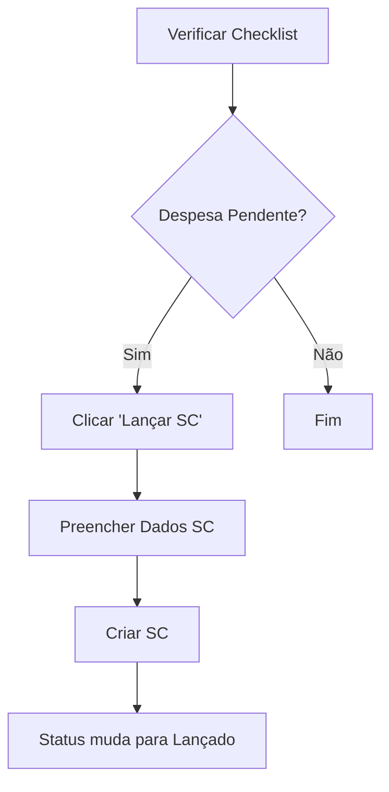
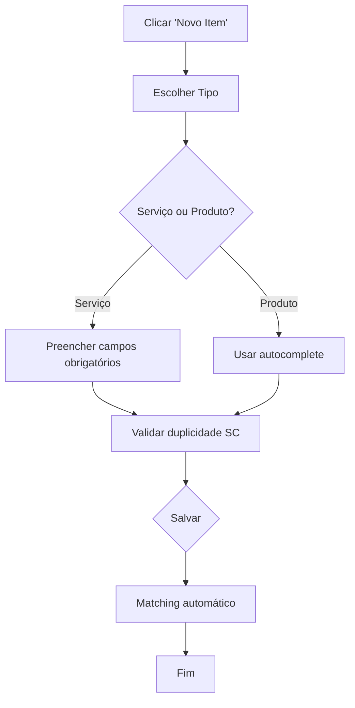
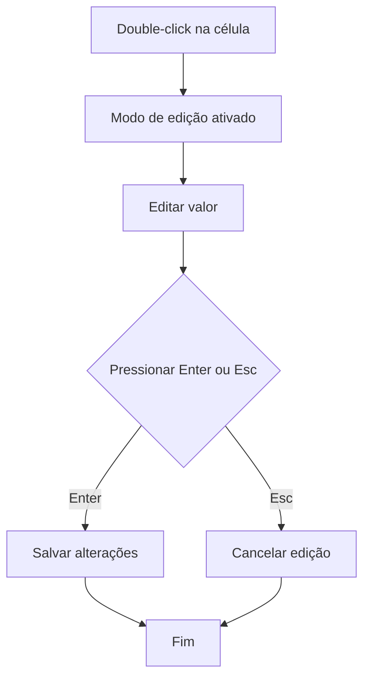

# 📝 Página de Solicitações

## Visão Geral

A página de **Solicitações** é um módulo central do sistema de gestão de TI, responsável por gerenciar solicitações de compras (SCs), controlar despesas recorrentes mensais e fornecer um painel de controle orçamentário. Esta página unifica três funcionalidades principais:

1. **Checklist de Despesas Recorrentes** - Controle mensal de despesas fixas
2. **Solicitações (Serviços e Produtos)** - Gerenciamento de pedidos de compra
3. **Central de Controle** - Dashboard orçamentário e estatísticas

## Estrutura da Página

### Abas Principais

A página é organizada em três abas principais:

#### 1. 📋 Checklist (Despesas Recorrentes Mensais)

Esta aba permite o controle mensal das despesas recorrentes através de uma checklist automatizada.

**Funcionalidades:**
- **Lista de Despesas Pendentes**: Mostra todas as despesas recorrentes que ainda não foram lançadas no mês atual
- **Status Visual**: Cada despesa tem status "Lançado" (verde) ou "Pendente" (laranja)
- **Botão "Lançar SC"**: Para despesas pendentes, permite criar uma SC automaticamente
- **Edição de Despesas**: Permite modificar dados das despesas recorrentes
- **Aviso de Reset**: Alerta sobre o reset mensal que ocorre no dia 1

**Fluxo de Lançamento:**
1. Identificar despesa pendente na lista
2. Clicar em "Lançar SC"
3. Preencher dados da SC (Nota Fiscal, Valor, OC, Situação)
4. Sistema cria automaticamente a SC na aba "Solicitações"
5. Status da despesa muda para "Lançado"

#### 2. 📝 Solicitações (Serviços e Produtos)

Esta aba gerencia todas as solicitações de compras divididas em duas categorias.

**Estrutura:**

##### Sub-aba: 🔧 Serviços
- **Campos principais**: Serviço, Descrição, Empresa, SC, Nota Fiscal, Valor, OC, Situação
- **Validação automática**: Verifica duplicidade de SC por empresa
- **Matching inteligente**: Vincula automaticamente com despesas recorrentes correspondentes

##### Sub-aba: 📦 Produtos
- **Campos principais**: Fornecedor, Produto, Informações, Empresa, SC, Nota Fiscal, Valor, OC, Situação
- **Autocomplete**: Sugere fornecedores e produtos baseados no histórico
- **Validação**: Previne SCs duplicadas na mesma empresa

**Funcionalidades Comuns:**
- **Edição Inline**: Double-click em qualquer célula para editar
- **Filtros**: Por tipo (Serviço/Produto), ano, busca por texto
- **Criação**: Modal para adicionar novos itens com validações
- **Exclusão**: Confirmação de segurança antes da remoção
- **Detecção de Duplicados**: Identifica automaticamente itens similares

#### 3. 📊 Central (Dashboard Orçamentário)

Esta aba fornece uma visão consolidada dos gastos e controle orçamentário.

**Painéis de Controle:**

##### Orçamento Total
- **Valor Configurado**: Orçamento mensal definido (R$ 150.000 padrão)
- **Gasto Atual**: Soma de todos os valores lançados no mês
- **Disponível**: Diferença entre orçamento e gasto atual
- **Edição**: Permite alterar o valor do orçamento

##### Barra de Progresso
- **Visualização percentual**: Mostra quanto do orçamento foi utilizado
- **Alertas visuais**: Cores mudam conforme o percentual (verde → laranja → vermelho)
- **Marcadores**: Indica níveis críticos (50%, 80%, 100%)

##### Distribuição por Empresa
- **Gráfico visual**: Barras representando gastos por marina
- **Percentuais**: Mostra participação de cada empresa no total
- **Ordenação**: Empresas listadas em ordem alfabética

##### Estatísticas Consolidadas
- **Total de Itens**: Quantidade total de serviços + produtos
- **Serviços vs Produtos**: Separação por categoria com valores
- **Valor Total**: Soma geral dos gastos
- **Cards de Despesas**: Taxa de lançamento e status mensal

##### Análise de Duplicados
- **Detecção automática**: Identifica itens potencialmente duplicados
- **Critérios**: Baseado em SC + Serviço/Produto + Empresa
- **Ações**: Permite marcar como resolvido ou fundir registros

## Funcionalidades Avançadas

### 1. Matching Automático de Despesas

Quando um serviço é criado, o sistema tenta automaticamente:
- **Identificar**: Despesa recorrente correspondente na checklist
- **Validar**: Combinação exata de Serviço + Empresa
- **Marcar**: Mudar status para "Lançado" automaticamente

**Critérios de Matching:**
1. **Match Exato**: Texto idêntico no campo de correspondência
2. **Match Parcial**: Contém ou é contido pelo texto de busca
3. **Empresa**: Deve corresponder exatamente
4. **Score Mínimo**: Threshold de 120 pontos para evitar falsos positivos

### 2. Validação de SCs

**Regras de Validação:**
- **Duplicidade**: Uma SC não pode ser usada duas vezes na mesma empresa
- **Campos Obrigatórios**: Serviço/Produto, Empresa, SC são obrigatórios
- **Formatação**: Valores monetários formatados automaticamente
- **Datas**: Validação de formato brasileiro (dd/mm/yyyy)

### 3. Autocomplete Inteligente

**Sugestões baseadas em:**
- **Histórico**: Serviços/produtos já cadastrados
- **Despesas Recorrentes**: Textos de correspondência
- **Fornecedores**: Lista de fornecedores ativos
- **Empresas**: Marinas disponíveis no sistema

### 4. Controle de Orçamento Dinâmico

**Alertas Automáticos:**
- **80% utilizado**: Aviso de atenção (laranja)
- **100% ultrapassado**: Alerta crítico (vermelho)
- **Edição em tempo real**: Modificação do orçamento refletida imediatamente

### 5. Reset Mensal Automático

**Sistema de Reset:**
- **Dia 1**: Todas as despesas recorrentes voltam para "Pendente"
- **Aviso preventivo**: 7 dias antes do reset
- **Backup**: Dados preservados, apenas status resetado

## Fluxos de Trabalho

### Fluxo 1: Lançamento de Despesa Recorrente

### Fluxo 2: Criação de Nova Solicitação

### Fluxo 3: Edição Inline

## Tabelas do Banco de Dados

### Principais Tabelas Utilizadas

1. **`servicos`** - Armazena solicitações de serviços
2. **`produtos`** - Armazena solicitações de produtos
3. **`despesas_recorrentes`** - Lista de despesas mensais
4. **`orcamento_config`** - Configuração do orçamento mensal

### Campos Importantes

**Tabela `servicos`:**
- `servico`, `descricao`, `empresa`, `sc`, `nota_fiscal`, `valor`, `oc`, `situacao`
- `created_at`, `updated_at`

**Tabela `produtos`:**
- `fornecedor`, `produto`, `informacoes`, `empresa`, `sc`, `nota_fiscal`, `valor`, `oc`, `situacao`
- `created_at`, `updated_at`

**Tabela `despesas_recorrentes`:**
- `apelido`, `match_texto`, `match_empresa`, `dia_vencimento`
- `status_mes_atual`, `valor_estimado`, `recorrencia`

## Configurações e Personalização

### Configurações Disponíveis

1. **Orçamento Mensal**: Valor base para controle de gastos
2. **Empresas/Marinas**: Lista de unidades para seleção
3. **Recorrências**: Padrões de periodicidade das despesas
4. **Limites de Alerta**: Percentuais para notificações

### Personalização por Usuário

- **Filtros Salvos**: Preferências de visualização mantidas
- **Colunas Visíveis**: Customização da tabela
- **Alertas**: Configuração de notificações por email

## Segurança e Auditoria

### Recursos de Segurança

- **Auditoria Completa**: Todas as operações são registradas
- **Validação de Permissões**: Controle de acesso por roles
- **Prevenção de Duplicatas**: Validações automáticas
- **Logs Detalhados**: Rastreamento de todas as modificações

### Logs de Auditoria

- **Criação**: Registro quando item é criado
- **Edição**: Histórico de modificações
- **Exclusão**: Log de remoções com dados anteriores
- **Matching**: Registro de associações automáticas

## Integrações

### Com Outros Módulos

1. **Logs de Auditoria**: Registra todas as operações
2. **Configurações**: Utiliza parâmetros globais do sistema
3. **Usuários**: Controle de permissões por usuário
4. **Dashboard**: Alimenta estatísticas gerais

### APIs Utilizadas

- **Supabase**: Banco de dados principal
- **Audit Service**: Registro de operações
- **Pages Maintenance**: Controle de status do sistema
- **Logger**: Sistema de logs unificado

## Dicas de Uso

### Para Usuários

1. **Sempre verifique a checklist** no início do mês
2. **Use o autocomplete** para agilizar cadastros
3. **Preste atenção aos alertas** de orçamento
4. **Faça backup** antes de edições em massa

### Para Administradores

1. **Configure o orçamento** adequadamente
2. **Monitore duplicatas** regularmente
3. **Ajuste regras de matching** conforme necessário
4. **Revise permissões** periodicamente

## Troubleshooting

### Problemas Comuns

1. **SC duplicada**: Verificar se já existe na mesma empresa
2. **Matching não funciona**: Revisar textos de correspondência
3. **Orçamento não atualiza**: Verificar permissões de edição
4. **Filtros não aplicam**: Limpar cache do navegador

### Suporte

Para problemas específicos, consulte:
- **Logs do sistema**: `/logs`
- **Documentação técnica**: Esta documentação
- **Administrador**: Contato direto com suporte

---

**Última atualização**: Dezembro 2025
**Versão**: 2.1
**Responsável**: Equipe de Desenvolvimento TI